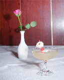
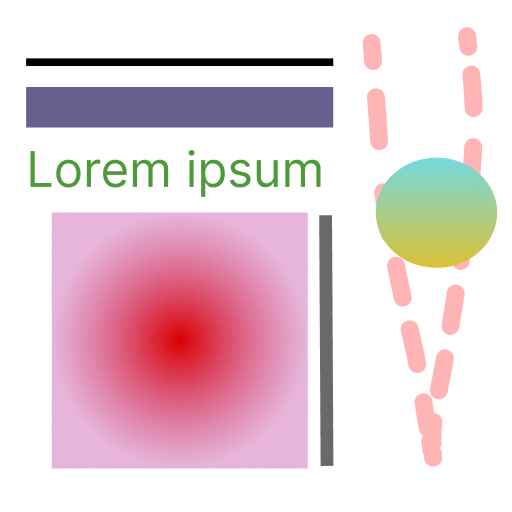
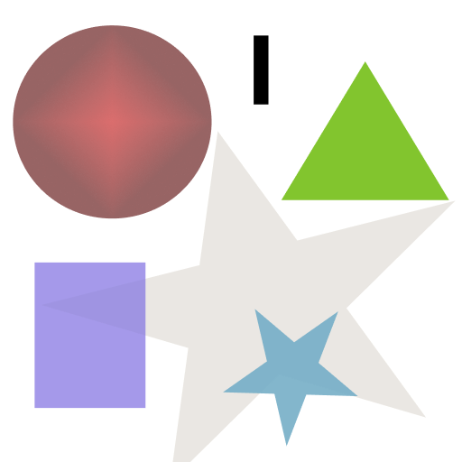
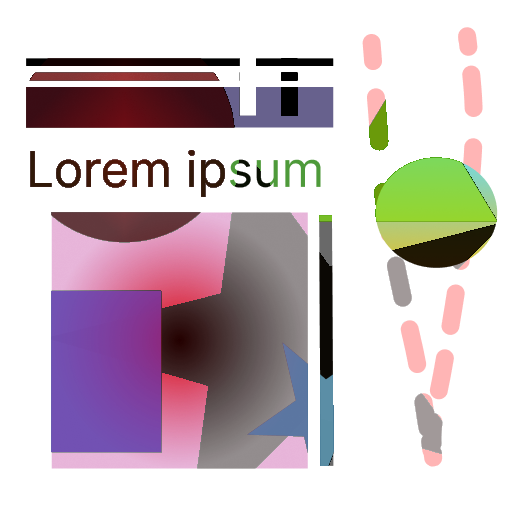
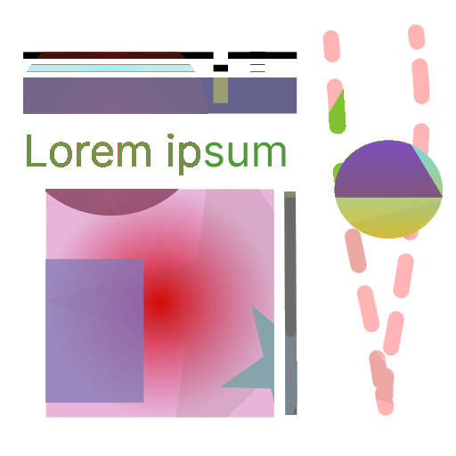
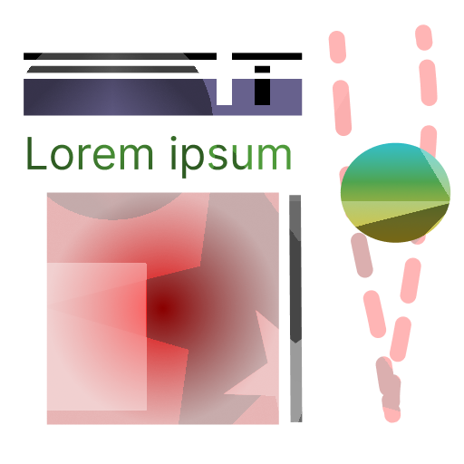
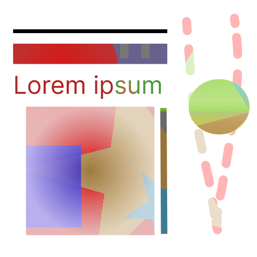

# Description

**Scala Kuva** is a Scala library that focuses on image and color processing and filtering.

# Functionality

## Color types

The library contains implementations for three color formats: **RGB(A)**, **HSL(A)**, and **HSV(A)**.
These color types are immutable and can be converted between each other. Additionally, they can also be converted to
java.awt.Color and created from it

## Immutable image

For all image operations in this library own implementation of the immutable image is used.
The Immutable image simply wraps two-dimensional Vector of immutable Pixels, offering some useful operations to work
with it in functional way.

It can also be converted to java.awt.image.BufferedImage and created from it.

## Color and image manipulation

This library contains implementation for various color and image operations. For example: most grayscale algorithms,
many blend modes, binarization, resizing with different algorithms, croping and more.

This initial image will be used to demonstrate the effects of the different operations.

### Basic image operations

#### Cropping

#### Scaling

##### Nearest Neighbor

Example image is downscaled (from 1024x1280 to 400 x 500) using nearest neighbor algorithm.

Example image is upscaled (from 128x160 to 1024x1280) using nearest neighbor algorithm.

##### Bilinear interpolation

Example image is upscaled (from 128x160 to 1024x1280) using bilinear interpolation.

##### Bicubic interpolation

Example image is upscaled (from 128x160 to 1024x1280) using bicubic interpolation.

#### Hashing

##### Average hash (aHash)

The average hash algorithm works by converting an image into a grayscale,
downsampling it to a small size (8x8 per default), computing the **average** pixel value, and creating a binary hash by
comparing each pixels value with the average value.

##### Median hash (mHash)

The average hash algorithm works by converting an image into a grayscale,
downsampling it to a small size (8x8 per default), computing the **median** pixel value, and creating a binary hash by
comparing each pixels value with the median value.

##### Difference hash (dHash)

The difference hash algorithm works by converting an image into a grayscale,
downsampling it to a small size (9x8 per default), and by computing the difference in pixel values between adjacent
pixels (compares each pixel with the pixel on the right from it).

### Blur

##### Box blur

##### Median blur

##### Gaussian blur

### Grayscale

##### Averaging

This algorithm simply uses average of all color channels as grayscale color.

##### Decomposition (using max channel value)

Calculates **max** value of 3 color channels and uses it as grayscale color.

##### Decomposition (using min channel value)

Calculates **min** value of 3 color channels and uses it as grayscale color.

##### Desaturation

This algorithm first convert color to HSL and then reduces saturation to 0.

##### Luma (ITU-R BT 601)

Calculate grayscale color using luma (luminance or brightness) formula (from ITU-R BT 601 specification).

##### Luma (ITU-R BT 709)

Also calculates grayscale color using luma formula, but from newer standard (ITU-R BT 709).
The weighting coefficients used in the formulas are different between the two standards.

##### Single channel (red)

Uses as grayscale color the value of red color channel

##### Single channel (green)

Uses as grayscale color the value of green color channel

##### Single channel (blue)

Uses as grayscale color the value of blue color channel

##### Lightness

Calculates and uses as grayscale lightness using formula from [this paper](https://www.academia.edu/13506981).

##### Lightness (HSL)

Calculates and uses as grayscale lightness using formula from HSL color format.

##### Middle value

Calculates and uses as grayscale middle value of the RGB channels

### N-shades of gray (using Luma 601 for initial grayscale)

Converts grayscale image to grayscale image with limited number of shades. (Example image has 8 shades of gray)

### Inversion

Color inversion is a photo effect that flips all colors to their opposite hue on the color wheel (with inversion of
alpha channel or without).

### Blending colors

To demonstrate different color blending algorithms two abstract (background and foreground) images will be used.
(There also additional examples in src/main/resources/source/blend/gradient folder)

Background (initial image):

Foreground (overlay image):

##### Simple Alpha Compositing

##### Dissolve

##### Multiply

##### Screen

##### Overlay

##### Hard Light

##### Soft Light

##### Color Dodge

##### Linear Dodge

##### Color Burn

##### Linear Burn

##### Vivid Light

##### Linear Light

##### Divide

##### Difference

##### Subtract

##### Lighten only

##### Darken only

##### Hard mix

##### Pin light

##### Reflect

##### Exclusion

##### Geometric mean

##### Luminosity

##### Color

### Binarization

Binarization is the process of converting a multi-tone grayscale image into a two-tone black and white image. This is
achieved by finding a threshold value, which is then used to create the binary output.

#### Otsu's method

Otsu's method is a thresholding technique used to separate an image into foreground and background pixels.
It calculates the optimal threshold value by maximizing the between-class variance of pixel intensities.

Otsu's method requires the image to be **converted into grayscale before applying the algorithm**, and the resulting
threshold value may vary depending on the specific grayscale conversion algorithm used.

