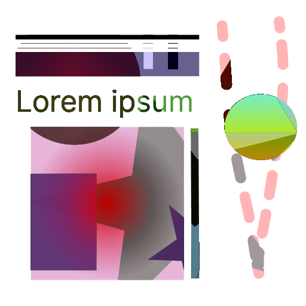

# scala-kuva

**scala-kuva** (kuva means "picture" in Finnish) is supposed to be a Scala library for color (and later image)
processing, manipulation, and filters.

### Functionality

## Color types

Currently, there are implementations for 3 color formats: **RGB(A)**, **HSL(A)**, and **HSV(A)**.

They can be converted between each other and converted to java.awt.Color.

## Color manipulation

Pictures used to demonstrate different color operations/filters below:

### Grayscale

Currently, this library contains these implementations of grayscale algorithms:

##### Averaging

This algorithm simply uses average of all color channels as grayscale color.

##### Decomposition (using max channel value)

Calculates **max** value of 3 color channels and uses it as grayscale color.

##### Decomposition (using min channel value)

Calculates **min** value of 3 color channels and uses it as grayscale color.

##### Desaturation

This algorithm first convert color to HSL and then reduces saturation to 0.

##### Luma (ITU-R BT 601)

Calculate grayscale color using luma (luminance or brightness) formula (from ITU-R BT 601 specification).

##### Luma (ITU-R BT 709)

Also calculates grayscale color using luma formula, but from newer standard (ITU-R BT 709).
The weighting coefficients used in the formulas are different between the two standards.

##### Single channel (red)

Uses as grayscale color the value of red color channel

##### Single channel (green)

Uses as grayscale color the value of green color channel

##### Single channel (blue)

Uses as grayscale color the value of blue color channel

##### Lightness

Calculates and uses as grayscale lightness using formula from [this paper](https://www.academia.edu/13506981).

##### Lightness (HSL)

Calculates and uses as grayscale lightness using formula from HSL color format.

### Inversion

Color inversion is a photo effect that flips all colors to their opposite hue on the color wheel (with inversion of
alpha channel or without).

### Blending colors

To demonstrate different color blending algorithms 2 abstract (background and foreground) images will be used.

Background (initial image):

Foreground (overlay image):

##### Simple Alpha Compositing

##### Dissolve

##### Multiply

##### Screen

##### Overlay

##### Hard Light

##### Soft Light

##### Color Dodge

##### Linear Dodge

##### Color Burn

### Binarization

Binarization is the process of converting a multi-tone grayscale image into a two-tone black and white image. This is
achieved by finding a threshold value, which is then used to create the binary output.

#### Otsu's method

Otsu's method is a thresholding technique used to separate an image into foreground and background pixels.
It calculates the optimal threshold value by maximizing the between-class variance of pixel intensities.

Otsu's method requires the image to be **converted into grayscale before applying the algorithm**, and the resulting
threshold value may vary depending on the specific grayscale conversion algorithm used.

### Darken

...

### Lighten

...

#### Saturation

...
